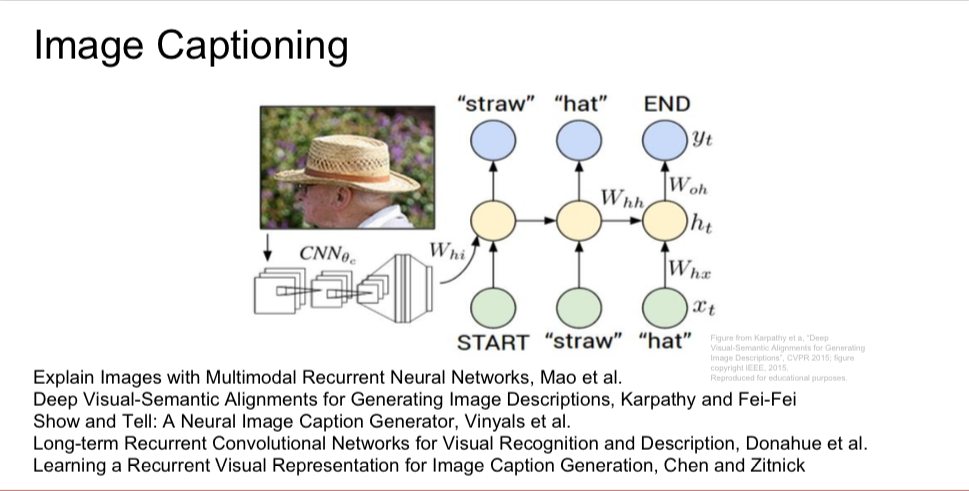
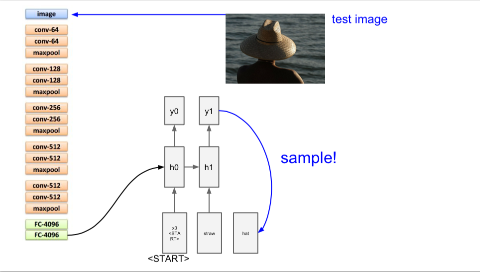

---
WeiShiwei 
DATE:2018/06/23
---

## RNN for image captioning
### 1、RNN网络layers
#### Vanilla RNN: forward/backward
- Vanilla RNN: step forward
- Vanilla RNN: step backward
#### Word embedding: forward/backward
因为word index的缘故,forward和backward的计算有些特别
#### Temporal Affine layer   
#### temporal_softmax_loss
- 有mask的softmax的loss计算/dx计算

### 2、CaptioningRNN(Train)
计算图是什么样子的

#### (1) Use an affine transformation to compute the initial hidden state from the image features. This should produce an array of shape (N, H) 
- h0 = np.dot(features, W_proj) + b_proj
#### (2) Use a word embedding layer to transform the words in captions_in from indices to vectors, giving an array of shape (N, T, W).        
- captions_in shape (N, T)
- W_embed shape is (vocab_size, wordvec_dim)
- x shape (N, T, W)
- x, cache_embedding = word_embedding_forward(captions_in, W_embed)
#### (3) Use either a vanilla RNN or LSTM (depending on self.cell_type) to process the sequence of input word vectors and produce hidden state vectors for all timesteps, producing an array of shape (N, T, H).    
**时间步**主要在rnn_forward/rnn_backward中计算
- x shape (N, T, W), h shape (N, T, H)
- h, cache_rnn = rnn_forward(x, h0, Wx, Wh, b)

#### (4) Use a (temporal) affine transformation to compute scores over the vocabulary at every timestep using the hidden states, giving an array of shape (N, T, V).
- h shape (N,T,H), scores (N,T,M)
- W_vocab, b_vocab IS Weight and bias for the **hidden-to-vocab transformation**.
- scores, cache_scores = temporal_affine_forward(h, W_vocab, b_vocab)

#### (5) Use (temporal) softmax to compute loss using captions_out, ignoring the points where the output word is <NULL> using the mask above.
- loss, dscores = temporal_softmax_loss(scores, captions_out, mask, verbose=False)     

### 3、CaptioningRNN(Test-time sampling)

测试阶段的RNN，首先利用affine transform把图片的特征转换成初始的隐藏状态h0，RNN的初始状态是Current word(<START> token),在每一个时间步中计算步骤如下
#### (1)把当前的词转化为词向量表示
- capt = self._start * np.ones((N, 1), dtype=np.int32), 初始化的当前Word，shape of (N, 1)
- word_embed, _ = word_embedding_forward(capt, W_embed), word_embed shape of (N, 1, D)
#### (2)在rnn_step_forward中，利用word_embed计算下一个隐藏状态h
- np.squeeze是把(N, 1, D)多维向量转化成(N, D)维特征
- h, _ = rnn_step_forward(np.squeeze(word_embed), prev_h, Wx, Wh, b)
#### (3)把隐藏状态h映射到vocabulary中词项的scores
- scores, _ = temporal_affine_forward(h[:, np.newaxis, :], W_vocab, b_vocab)
#### (4)选择一个score最大的word作为当前时间步的输出，和下一个时间步的输入，记录到captions中
- idx_best = np.squeeze(np.argmax(scores, axis=2))
- captions[:, t] = idx_best